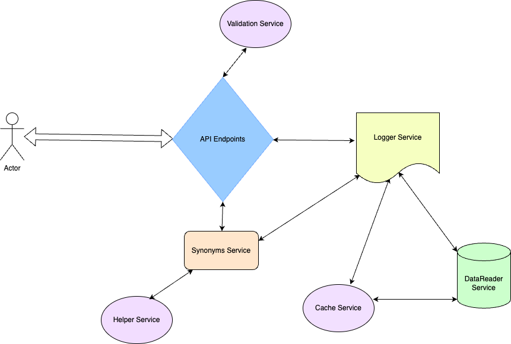

## WebApp - Thesaurus Dictionary

This is a web application built using .NET 8, HTML, CSS and JQuery.

### Functional Requirements

• Add Word

• Get Synonyms of a given word

• View All Words

Create a simple UI experience that can fully interact with the thesaurus.

### Non-Functional Requirements

• Performance

• Custom Logging

• Avoid Duplicity of words

• Testability using UTCs and Integration Tests

• Validations

• Maintainability

### Core Entities

• Word

• Synonyms

### API Endpoints

- **POST /addword**  
    Adds a new word with its synonyms after performing validation checks.
- **GET /getsyn?word={word}**  
    Retrieves synonyms for a given word.
- **GET /**  
    Returns a list of all words currently stored in the system.

### High Level Design

## Steps to Run the Application

### 1\. Clone the Repository

git clone [https://github.com/ProManXi/BeijerThesaurusProject.git]

cd BeijerThesaurusProject

### 2\. Open the Project

You can open the project in any of the following:

- **Visual Studio 2022 or later** (recommended)
- **Visual Studio Code** (with C# extension installed)

### 3\. Build the Application

dotnet build

### 4\. Startup Project

Set ThesaurusWebAPI as Startup project

dotnet restore

### 5\. Run the Application

dotnet run

By default, the API will be available at:

<http://localhost:5186>

### 6\. Test API Endpoints

You can test the following endpoints using tools like **Postman**, **curl**, or a **frontend app**:

- POST /addword – Add a word and its synonyms
- GET /getsynonyms – Get synonyms for a given word
- GET / – Get all words in the system

### 7\. Run Unit Tests and Integration Tests

If you have unit tests set up in a test project:

dotnet test
